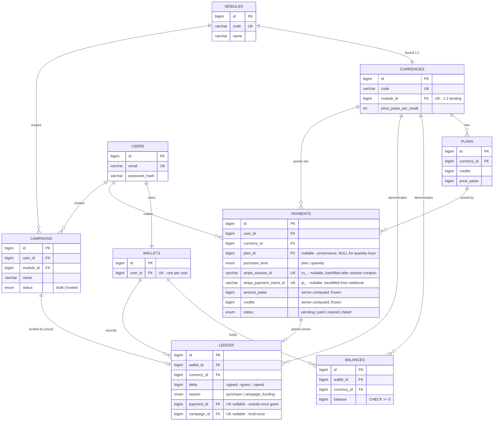

# DESIGN.md — Multi-Currency Credits Wallet & Campaign Funding

> This document is authoritative for the **schema and the guarantees**. The HTTP contract — paths, request/response bodies, status codes, error codes, and flow diagrams — lives in [docs/API.md](docs/API.md).

## Design stance

The happy path is trivial CRUD; the assignment is about **correctness when things go wrong** — duplicate/out-of-order/forged webhooks, retries, and concurrent requests. The design pushes every safety-critical guarantee **down into the database** (unique constraints, row locks, transactional atomicity) rather than relying on application control flow, because application checks have time-of-check-to-time-of-use (TOCTOU) races under concurrency that the database does not.

Two principles run through everything:

1. **The ledger is the source of truth.** Every credit movement is an append-only, signed ledger row. Balances are a *materialized, transactionally-maintained* projection of the ledger that exists to be locked and read in O(1) — never a second, independent source of truth.
2. **Idempotency is keyed on the payment, not the event.** One Stripe payment fans out into several events (`payment_intent.created/succeeded`, `charge.succeeded/updated`, `checkout.session.completed`), each with a distinct `evt_` id but sharing one `cs_`/`pi_`. Keying on the payment makes "grant exactly once **per payment**" a schema-level fact that survives the fan-out and all redelivery.

---

## Schema & ER diagram

### Table notes (load-bearing details only)

- **`modules`, `currencies`, `plans`** are **seeded configuration**, not created at runtime. Prices are stored, so a new currency/module drops in as data with no business-logic change.
- **Currency↔module binding** is `currencies.module_id` with a **`UNIQUE(module_id)`** → each module has exactly one bound currency. Spend resolves `campaign.module_id → currency`; any other currency is rejected *structurally*, with no hardcoded `if (currency === 'campaign')`. This is what lets Reports/Discovery spending be added later by pattern, not rewrite.
- **`plans.price_paise`** is stored (not computed) because bundles are discounted vs. `credits × per_credit_price` (e.g. 1000 Campaign Credits = ₹2,700, not ₹3,000).
- **`balances`** — one row per `(wallet_id, currency_id)`, enforced by **`UNIQUE(wallet_id, currency_id)`**. This composite unique is what makes `SELECT … FOR UPDATE` lock *exactly one* row, which is the entire concurrency-safety mechanism for spends. All three rows are provisioned at `0` when the wallet is created, so every grant/spend can assume the row exists and is lockable. `CHECK(balance >= 0)` is a DB-level floor beneath the app's insufficient-funds check (requires MySQL 8.0.16+).
- **`ledger`** is append-only and carries **two** structural guarantees via MySQL's "UNIQUE allows many NULLs" behaviour:
  - `UNIQUE(payment_id)` → **exactly-once grant per payment** (purchase rows).
  - `UNIQUE(campaign_id)` → **fund-a-campaign-at-most-once** (funding rows).
  - Purchase rows have `campaign_id = NULL`; funding rows have `payment_id = NULL`; the many-NULLs rule lets both coexist. Two nullable FK columns were chosen over a polymorphic `reference_type/reference_id` **precisely because** a real FK and a real per-type UNIQUE can hang off each — the polymorphic form can give neither at the schema level.
- **`payments`** is inserted (`status='pending'`) **before the Stripe Checkout Session is created**, and therefore before any webhook — so the grant is a one-way `pending → paid` transition on a row guaranteed to exist. The **idempotency identity is `payments.id`** (enforced downstream by `UNIQUE(ledger.payment_id)`), carried on the session as `metadata.payment_id`. Both Stripe id columns are **nullable-unique** and backfilled: `stripe_session_id` immediately after session creation, `stripe_payment_intent_id` from the webhook, the latter for reconciliation and future refund/dispute events (which key on `pi_`/`ch_`, not `cs_`). They are unique so a given Stripe object can never attach to two payment rows, and nullable because the row legitimately predates both ids. Stripe's id chain is **denormalized here** — no separate PI/charge tables — because within this scope the relationship is 1:1 and terminal.
- **`payments.plan_id` + `payments.purchase_kind`** separate *provenance* from *what was charged*. `purchase_kind` discriminates `plan` from `quantity`; `plan_id` is a nullable FK, populated for `plan` buys and `NULL` for per-credit `quantity` buys (which have no bundle behind them). Crucially `plan_id` is **not a pricing input** — `amount_paise` and `credits` are computed at session-creation time and **frozen** onto the payment row. So if a plan's price is later edited in config, the historical purchase still reads back at the price actually charged, while the FK still says which config row priced it. Config is mutable; the ledger must not be. Keeping both is what makes "every credit traces to a real payment, and every payment to the exact bundle and amount that produced it" true rather than merely claimed. The pairing invariant (`plan` ⇒ `plan_id` present, `quantity` ⇒ `plan_id` NULL) is enforced in the service layer, not as a `CHECK` — expressible either way, but past the point of useful return at this scope.
- **`campaigns.status`** `draft → funded` transition, taken under a row lock, is the readable fund-at-most-once layer; `UNIQUE(ledger.campaign_id)` is the structural backstop beneath it. `campaigns.name` is a display field only — nothing in the funding path reads it.
- **Naming.** `modules.code` / `currencies.code` are named `code`, not `key`: `KEY` is structurally reserved in MySQL (it is the keyword for index declarations — `PRIMARY KEY`, `ADD KEY`, `UNIQUE KEY`), so the parser is especially aggressive about it. Sequelize backticks generated queries, but the failure leaks exactly where it hurts most — an ad-hoc `SELECT … WHERE key = …` in a live `mysql>` session. Every model also pins `tableName` explicitly rather than relying on Sequelize's automatic pluralization, so the migration, the model, and hand-typed SQL always agree on one name. `ledger` is deliberately **singular**: it is one conceptual object — *the* ledger, the source of truth — not a bag of entries.

---

## Where idempotency & transactions live

**Idempotency** is enforced by database constraints, not application checks:

| Guarantee | Enforced by |
|---|---|
| Grant exactly once per payment | `UNIQUE(ledger.payment_id)` + `payments.status` monotonic `pending→paid` |
| Fund a campaign at most once | `UNIQUE(ledger.campaign_id)` + `campaigns.status` monotonic `draft→funded` |
| One payment per Checkout session | `UNIQUE(payments.stripe_session_id)` |
| At most one row per PaymentIntent | `UNIQUE(payments.stripe_payment_intent_id)` (nullable) |

The application-level `if (status === 'pending')` guard is kept as a **fast-path optimization** (early-exit on the common duplicate), but it is explicitly *not* the safety net — the unique index is. When a duplicate insert raises a duplicate-key error, the handler treats it as **idempotent success** and returns `2xx` so Stripe stops retrying; only genuinely transient failures return `5xx` to invite redelivery.

**Two transaction boundaries:**

1. **Grant** (webhook handler): payment-row lock → ledger insert (`+credits`) → balance increment → status flip → commit.
2. **Fund** (campaign funding): campaign-row lock → currency resolution → balance-row lock → insufficient check → ledger insert (`−credits`) → balance decrement → status flip → commit.

**Lock ordering is fixed** (campaign row locked before balance row in the fund flow) to keep a consistent acquisition order and avoid deadlocks.

---

## Flow walkthroughs

### Buy credits

1. Authenticated user chooses currency + (plan | quantity). **Server computes `amount_paise`** from seeded config — the client-supplied amount is never trusted.
2. **Ordering rule: the local record precedes the money-moving object, always.** The `payments` row is inserted **first** (`status='pending'`, no `cs_` yet). Only then is the Stripe Checkout Session created, with **`metadata.payment_id` stamped onto it**. The returned `cs_` is backfilled onto the row. Frontend redirects to Stripe.
3. On payment, Stripe sends webhooks. The handler **verifies the `Stripe-Signature` on the raw request body first** (forged/unsigned → `400`, DB never touched).
4. The handler resolves the `payments` row in **two tiers**: by `stripe_session_id` (normal path), and on miss by `metadata.payment_id` carried on the event — backfilling the missing `cs_`/`pi_` onto the row inside the same grant transaction.
5. Grant fires **only** on `checkout.session.completed` with `payment_status === 'paid'`, inside transaction boundary #1.

**Why this order.** Stripe is the authority on *money*; this database is the authority on *grants*. The one failure that cannot be tolerated is money taken with no local record to hang the grant on — because the idempotency contract below (`200` on a genuinely unknown payment, so Stripe stops retrying) would then convert it into **permanent silent loss**: a charged user, no credits, and a webhook that cheerfully swallows the evidence. Creating the session before the row is disqualified not because the insert is *likely* to fail, but because its failure is the worst outcome in the system. Under insert-first, every failure lands on the harmless side:

| Failure point | Outcome |
|---|---|
| Insert fails | No Stripe call was made. Nothing charged. Request errors to the user. Clean. |
| Session creation fails (after insert) | Orphan `pending` row that never transitions. Harmless — a pending intent that expires in place. |
| `cs_` backfill fails (session exists, row not updated) | Caught by the tier-2 metadata lookup, which heals the row during the grant. |

**`metadata.payment_id` is the durable anchor; `stripe_session_id` is a convenience index.** The metadata is written atomically with the session's *existence* and cannot drift from it; the `cs_` column is a post-hoc backfill that can fail or lag. Treating the metadata as the real join key — and the `cs_` column as an optimization that gets healed on miss — is what closes the gap. The same tier-2 path also covers the **reverse race** on the happy path: a fast Stripe webhook arriving before a slow backfill commits. One mechanism, both problems.

**Failure points & defences**

- *Duplicate delivery / multi-event fan-out / out-of-order arrival* → all resolve to the same `payments` row (by `cs_`, or by `metadata.payment_id`) → the `pending→paid` transition and `UNIQUE(ledger.payment_id)` make every extra delivery a harmless no-op. The unique index does not care which lookup tier found the row, so the grant stays exactly-once either way. Order-independent by construction: the `payments` row is inserted before the session exists, so no event can ever arrive early enough to find "no row".
- *Async payment methods* (`payment_status: 'unpaid'` on `completed`) → fail the `paid` guard, grant nothing; funds-cleared later arrives as `checkout.session.async_payment_succeeded` (also `paid`) and grants through the *same* payment-keyed transition. **Not exercised in this build (card only)** but the guard makes premature grants impossible regardless — see honest notes.
- *Forged webhook* → signature check rejects before the DB.
- *Credit without payment* → impossible: the grant is gated on a verified, `paid` webhook, never on the browser redirect.

### Fund a campaign

1. Authenticated user funds their `draft` campaign with an amount of Campaign Credits.
2. Transaction boundary #2: lock campaign row → resolve `campaign.module → bound currency` → lock the single `balances` row for `(wallet, that currency)` `FOR UPDATE` → check `balance >= amount` → insert ledger `−amount` → decrement balance → flip `draft→funded` → commit.

**Failure points & defences**

- *Wrong-currency spend* → the currency is *resolved from the module binding*, not supplied by the caller; a request naming Report/Discovery credits cannot fund a campaign.
- *Insufficient balance* → checked under the row lock; rejected with ledger and balance untouched.
- *Concurrent spends* → serialized on the single `balances` row lock; the second request reads the already-decremented balance and rejects if now insufficient. `CHECK(balance >= 0)` is the final floor.
- *Double-fund (same campaign, concurrent)* → one request wins the `draft→funded` transition; `UNIQUE(ledger.campaign_id)` rolls back any second funding row.

---

## Acceptance criteria → mechanism

| Criterion | Mechanism |
|---|---|
| Per currency, balance = Σ ledger | `balances` updated in the *same transaction* as every ledger insert; asserted by test |
| Granted exactly once per payment, never without payment | `pending→paid` + `UNIQUE(ledger.payment_id)`; grant gated on `completed && payment_status='paid'` |
| Each currency spent only in its module | `currencies.module_id` (1:1) resolved from `campaigns.module_id`; mismatch rejected |
| Balance never negative | `SELECT … FOR UPDATE` + insufficient check + `CHECK(balance >= 0)` |
| Campaign funded at most once | campaign `draft→funded` under lock + `UNIQUE(ledger.campaign_id)` |
| Concurrent spends cannot over-spend | serialized on the single `balances` row lock |
| Wallet/campaign endpoints need login | JWT auth middleware |

---

## Key decisions (and when I'd revisit each)

- **Grant on `checkout.session.completed` (session-level), not `payment_intent.succeeded`.** The session object carries the business metadata and the `cs_` exists synchronously at creation, so the `payments` row is trivially keyed and always findable. *Would switch to `payment_intent.succeeded` if delayed methods / manual capture became first-class,* carrying the payment reference via `payment_intent_data.metadata`.
- **Materialized balance row, not purely ledger-derived `SUM()`.** A spend needs a single row to lock; deriving the balance would force inventing a lock row anyway (reinventing this table) plus aggregate reads. *Purely-derived would be fine if there were no concurrent spend requirement.*
- **Stripe ids denormalized onto `payments`, not a normalized PI/charge sub-tree.** The grant is one-shot and terminal, so charge/refund lifecycle tables would be over-modeling. *Would normalize the moment refunds/disputes/retries need first-class ongoing state.*
- **Explicit `SELECT … FOR UPDATE` then `UPDATE`** for the spend decrement (over the atomic `UPDATE … WHERE balance >= :amt`), for readability and an obvious walkthrough narration. Both are correct.

---

## Honest notes — improvements & not-done

*(Fill in as the build progresses.)*

- **Async payment methods not implemented** — card (synchronous) only. The `payment_status === 'paid'` guard already prevents premature grants; the async path (`async_payment_succeeded` / `async_payment_failed`) would slot into the same payment-keyed transition but is out of scope as no delayed method is enabled.
- **INR in Stripe test mode not yet verified on the account** — Indian Stripe accounts have export/currency rules; a real Checkout run must confirm INR test charges work early.
- **Orphan `pending` payments are left in place — deliberately, not by omission.** A `payments` row is inserted before the Checkout Session exists, so any session the user abandons (or that fails to create after the insert) leaves a `pending` row that never reaches a terminal state. This is harmless to correctness — no balance, ledger entry, or grant depends on it, and it can never become `paid` without a verified webhook — but the rows accumulate. The production follow-up is a periodic sweeper that reconciles `pending` rows against Stripe and expires them past the Checkout Session TTL (24h), moving them to `expired`. Not built here: it is operational hygiene rather than a correctness guarantee, and the `expired` status already exists in the enum to receive it.
- Refunds, disputes, and credit expiry are out of scope.
- (Add: anything cut for time, with what you'd do next.)
