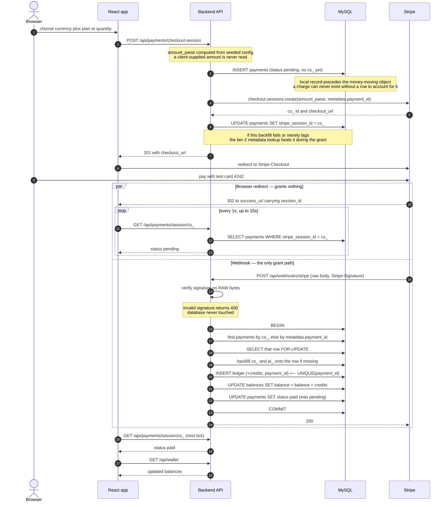
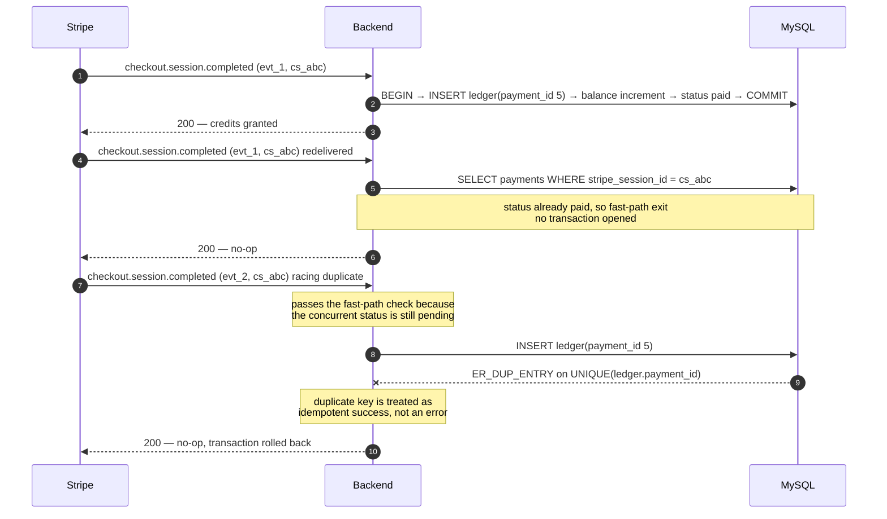
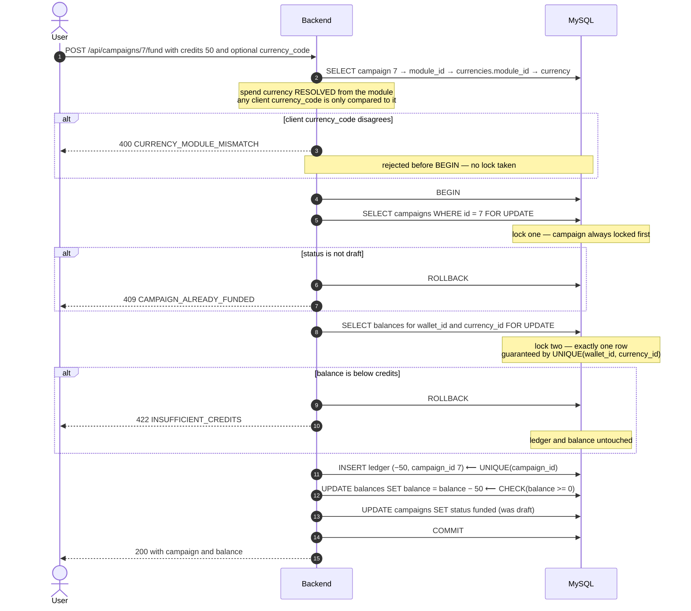
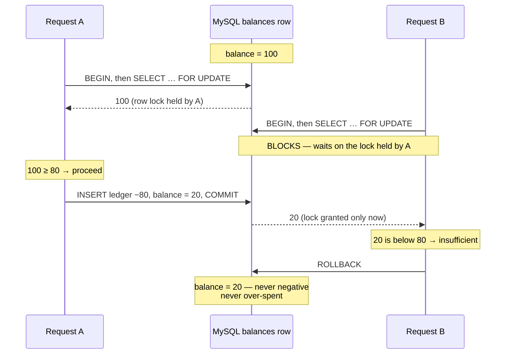

# API.md — HTTP contract

Companion to [`DESIGN.md`](../DESIGN.md). DESIGN.md is authoritative for the **schema and the guarantees**; this document is authoritative for the **wire format** — paths, bodies, status codes, and error codes.

The rule that shapes everything below: the HTTP layer never gets to decide anything safety-critical. Amounts are computed server-side from seeded config, the spend currency is resolved from the campaign's module, and credits are granted only inside the webhook transaction. A client can express *intent*; it cannot express *outcome*.

---

## Conventions

**Base path** `/api`. JSON request and response bodies throughout, with one deliberate exception: the Stripe webhook route consumes the **raw body** (`express.raw`), mounted ahead of the global JSON parser so the signature can be verified against the exact bytes Stripe signed.

**Auth** — `Authorization: Bearer <jwt>`. HS256, 7-day expiry, subject is the user id. Protected routes are marked 🔒.

**Units** — every money field is an integer named `*_paise`; every credit field is an integer named `credits` or `delta`. No field carries a decimal and no field is named bare `amount`, so a wrong-unit bug has nowhere to hide. ₹3.00 is `300`.

**Errors** — every non-2xx response is:

```json
{ "error": { "code": "INSUFFICIENT_CREDITS", "message": "Balance 20 is less than the requested 80 credits.", "details": [] } }
```

Clients branch on `code`, never on `message`. `details` carries per-field validation failures and is `[]` otherwise.

**Pagination** — `?limit=` (default 50, max 200) and `?offset=` (default 0). Paged responses return `{ items: [...], total, limit, offset }`.

**Ownership** — a resource belonging to another user returns **404, not 403**. Ownership is not an information leak.

---

## Flow diagrams

### 1. Buy credits — the redirect and the webhook are racing

The key structural fact: Stripe redirecting the browser and Stripe calling our webhook are two independent events with **no ordering guarantee**. The left branch below is cosmetic; the right branch is the only thing that moves credits.



If the poll exhausts its 15s the UI shows a static "awaiting confirmation" message and a Refresh button. It never concludes the payment succeeded on its own.

### 2. Duplicate & fanned-out webhooks — granted exactly once

One payment produces several Stripe events with different `evt_` ids but the same `cs_`. Redeliveries add more. All of them collapse onto one `payments` row.



The third case is why the application-level `status === 'pending'` check is documented as a *fast path* and not as the guarantee. Two concurrent deliveries can both pass it; only one can win the unique index.

### 3. Fund a campaign — resolved currency, ordered locks



Lock order is fixed — campaign, then balance — in every path that takes both, so two funding requests can never hold one lock each and wait on the other.

### 4. Concurrent funding — serialized on one row

Two requests, one wallet, balance 100, each asking for 80.



B reads `20`, not the stale `100`, because `FOR UPDATE` made it wait for A's commit rather than reading a snapshot. This is the mechanism the concurrency test asserts.

---

## Endpoints

### Auth

#### `POST /api/auth/signup`

```json
{ "email": "a@b.com", "password": "at least 8 chars" }
```

→ `201`

```json
{ "user": { "id": 1, "email": "a@b.com" }, "token": "eyJ…" }
```

The user, their wallet, and **one zero-balance row per currency** are created in a single transaction. Provisioning all balance rows up front is what lets every later grant and spend assume the row exists and is lockable — there is no lazy-create path to race against.

Errors — `400 VALIDATION_ERROR`, `409 EMAIL_ALREADY_REGISTERED`.

#### `POST /api/auth/login`

```json
{ "email": "a@b.com", "password": "…" }
```

→ `200 { "user": { "id": 1, "email": "a@b.com" }, "token": "eyJ…" }`

Errors — `400 VALIDATION_ERROR`, `401 INVALID_CREDENTIALS`. A wrong email and a wrong password return the identical error, so the endpoint is not an account-existence oracle.

#### `GET /api/auth/me` 🔒

→ `200 { "user": { "id": 1, "email": "a@b.com" } }`

---

### Config

#### `GET /api/currencies`

Public — this is seeded platform configuration, not user data. It exists so the frontend never hardcodes a price.

→ `200`

```json
[
  {
    "code": "campaign",
    "name": "Campaign Credits",
    "module": { "code": "campaigns", "name": "Campaigns" },
    "price_paise_per_credit": 300,
    "plans": [
      { "id": 1, "credits": 100,  "price_paise": 30000 },
      { "id": 2, "credits": 1000, "price_paise": 270000 }
    ]
  },
  {
    "code": "report",
    "name": "Report Credits",
    "module": { "code": "reports", "name": "Reports" },
    "price_paise_per_credit": 1000,
    "plans": [
      { "id": 3, "credits": 10,  "price_paise": 10000 },
      { "id": 4, "credits": 100, "price_paise": 90000 }
    ]
  },
  {
    "code": "discovery",
    "name": "Discovery Credits",
    "module": { "code": "discovery", "name": "Discovery" },
    "price_paise_per_credit": 500,
    "plans": [
      { "id": 5, "credits": 100,  "price_paise": 50000 },
      { "id": 6, "credits": 1000, "price_paise": 450000 }
    ]
  }
]
```

Plan prices are **stored, not derived** — bundles are discounted against the per-credit rate (1000 Campaign Credits is ₹2,700, not ₹3,000).

---

### Wallet 🔒

#### `GET /api/wallet`

→ `200`

```json
{
  "wallet_id": 1,
  "balances": [
    { "currency_code": "campaign",  "currency_name": "Campaign Credits",  "balance": 100 },
    { "currency_code": "report",    "currency_name": "Report Credits",    "balance": 0 },
    { "currency_code": "discovery", "currency_name": "Discovery Credits", "balance": 0 }
  ]
}
```

Always all three currencies, including zeros — the rows exist from signup.

#### `GET /api/wallet/ledger`

Query — `currency_code` (optional filter), `limit`, `offset`. Newest first.

→ `200`

```json
{
  "items": [
    { "id": 12, "currency_code": "campaign", "delta": -50,  "reason": "campaign_funding",
      "payment_id": null, "campaign_id": 7, "created_at": "2026-07-31T10:04:00.000Z" },
    { "id": 11, "currency_code": "campaign", "delta": 100, "reason": "purchase",
      "payment_id": 5, "campaign_id": null, "created_at": "2026-07-31T10:00:00.000Z" }
  ],
  "total": 2, "limit": 50, "offset": 0
}
```

`delta` is signed — positive for purchases, negative for spends. For any currency, the sum of `delta` equals that currency's balance; that identity is the assignment's headline acceptance criterion and is asserted directly in the test suite.

---

### Payments 🔒

#### `POST /api/payments/checkout-session`

Exactly one of `plan_id` or `quantity`, and `currency_code` is required in both forms.

```json
{ "currency_code": "campaign", "plan_id": 1 }
```
```json
{ "currency_code": "campaign", "quantity": 250 }
```

→ `201`

```json
{
  "payment_id": 5,
  "stripe_session_id": "cs_test_a1b2…",
  "checkout_url": "https://checkout.stripe.com/c/pay/cs_test_a1b2…",
  "credits": 100,
  "amount_paise": 30000
}
```

`credits` and `amount_paise` are echoed for display only; they are computed server-side and frozen onto the `payments` row. A `plan_id` belonging to a different currency than `currency_code` is rejected — the client declares intent, the server validates it against config, and the server alone prices it.

**Order of operations is load-bearing.** The `payments` row is inserted *before* the Stripe session is created, the session carries `metadata.payment_id`, and `cs_` is backfilled onto the row afterwards. The local record always precedes the money-moving object, so a charge can never exist without a row to account for it. See [DESIGN.md → Buy credits](../DESIGN.md#buy-credits) for the failure-by-failure argument.

Stripe is configured with:
- `success_url` = `{FRONTEND_URL}/wallet?checkout=success&session_id={CHECKOUT_SESSION_ID}`
- `cancel_url` = `{FRONTEND_URL}/wallet?checkout=cancelled`

**`Idempotency-Key` header — optional, strongly recommended.**

A retried POST without one creates a second `payments` row *and* a second live Stripe session. No credits can be fabricated — the grant is keyed on `payments.id` and guarded by `UNIQUE(ledger.payment_id)` — but both sessions are payable, so one intent can produce two charges.

Send an opaque token (a UUID) identifying the **intent**, not the attempt: the same key on every retry of one purchase.

- Repeat with the same key and the same parameters → the original payment is returned, `201`, with `Idempotent-Replayed: true`. The body is byte-identical to the first response; a replay must be indistinguishable.
- Repeat with the same key but *different* parameters → `409 IDEMPOTENCY_KEY_REUSED`. Silently returning the original would charge for something the caller did not just ask for.
- Concurrent duplicates → one wins `UNIQUE(payments.user_id, idempotency_key)`; the others get `409 IDEMPOTENT_REQUEST_IN_PROGRESS` while the winner is still creating the session.
- Repeat after the first attempt's Stripe call failed → the original payment is **resumed**: Stripe is called again with an idempotency key derived from `payments.id`, so the result is the session the first attempt created if it created one, never a second. `201`, `Idempotent-Replayed: true`.
- Repeat for a payment that can no longer be resumed (not `pending`, or older than 23h — inside Stripe's 24h key retention) → `409 CHECKOUT_NOT_RESUMABLE`. Generate a new key to start a new purchase.

Keys are scoped **per user**, never globally. A global key space would let one caller claim a value another later sends, and answer them with the first caller's payment and checkout URL.

Errors — `400 VALIDATION_ERROR` (neither or both of `plan_id`/`quantity`, non-positive `quantity`, empty `Idempotency-Key`), `400 PLAN_CURRENCY_MISMATCH`, `404 NOT_FOUND` (unknown currency or plan), `409 IDEMPOTENCY_KEY_REUSED`, `409 IDEMPOTENT_REQUEST_IN_PROGRESS`, `409 CHECKOUT_NOT_RESUMABLE`.

#### `GET /api/payments/session/:stripeSessionId`

The endpoint the post-redirect page polls. **Reads our own `payments` row — it makes no call to Stripe and it cannot grant credits.** Scoped to the authenticated user; someone else's session is a 404.

→ `200`

```json
{
  "payment_id": 5,
  "stripe_session_id": "cs_test_a1b2…",
  "status": "pending",
  "purchase_kind": "plan",
  "credits": 100,
  "currency_code": "campaign",
  "amount_paise": 30000
}
```

`status` is one of `pending | paid | expired | failed`. The frontend polls at 1s for up to 15s, then stops and shows a manual Refresh.

---

### Stripe webhook

#### `POST /api/webhooks/stripe`

Not JSON-parsed and not JWT-protected — authenticated instead by the `Stripe-Signature` header verified against the **raw request body**. This route is mounted before `express.json()`; if it were mounted after, the raw bytes would already be consumed and every signature check would fail.

Credits are granted **only** on `checkout.session.completed` with `payment_status === 'paid'`. Every other event type is acknowledged and ignored.

**Two-tier payment resolution.** The handler finds the `payments` row by `stripe_session_id` first. On a miss it falls back to `metadata.payment_id` carried on the session, loads that row, and backfills the missing `cs_`/`pi_` onto it *inside the same grant transaction*. The metadata is written atomically with the session's existence and cannot drift; the `cs_` column is a post-hoc backfill that can fail or lag. Tier 2 therefore covers both the backfill *failing* and the backfill merely being *late* — a fast webhook overtaking a slow write on the happy path. Which tier found the row has no bearing on exactly-once: the grant is keyed on `payments.id` either way, and `UNIQUE(ledger.payment_id)` is indifferent to how the row was located.

Response contract:

| Situation | Status | Why |
|---|---|---|
| Missing or invalid signature | `400` | Rejected before any database access |
| Verified, credits granted | `200` | |
| Verified, already `paid` (fast path) | `200` | Idempotent success — stop retrying |
| Verified, `UNIQUE(ledger.payment_id)` violated | `200` | Same — a concurrent duplicate lost the race |
| Verified, unhandled event type | `200` | Acknowledged, ignored |
| Verified, `completed` but `payment_status !== 'paid'` | `200` | Nothing granted; not an error |
| No row found by `cs_` **nor** by `metadata.payment_id` | `200` | Genuinely unknown to us — retrying cannot fix it |
| Transient database/infrastructure failure | `500` | Invite Stripe to redeliver |

The distinction that matters: `5xx` is reserved for failures a retry could plausibly fix. Anything permanent returns `2xx` so Stripe's retry schedule stops hammering an endpoint that will never succeed.

---

### Campaigns 🔒

#### `POST /api/campaigns`

```json
{ "name": "Summer influencer push" }
```

→ `201`

```json
{ "id": 7, "name": "Summer influencer push", "module_code": "campaigns",
  "status": "draft", "funded_credits": null, "created_at": "2026-07-31T10:02:00.000Z" }
```

The client does **not** choose a module. The server assigns the `campaigns` module, because choosing a module is choosing a currency, and that is not a client decision.

#### `GET /api/campaigns`

Query — `limit`, `offset`. Returns only the authenticated user's campaigns.

→ `200 { "items": [ …campaign… ], "total": 1, "limit": 50, "offset": 0 }`

`funded_credits` is **derived from the joined ledger row**, not stored on `campaigns`. The ledger is the source of truth for credit movement; duplicating the amount onto the campaign would create a second place to be wrong.

#### `GET /api/campaigns/:id`

→ `200` with the same shape. Another user's campaign is `404 NOT_FOUND`.

#### `POST /api/campaigns/:id/fund`

```json
{ "credits": 50 }
```
```json
{ "credits": 50, "currency_code": "campaign" }
```

`currency_code` is **optional and never used as input**. The spend currency is resolved from `campaign.module_id → currencies.module_id`. If the client supplies a `currency_code` that disagrees with the resolved one, the request is rejected *before the transaction opens*, so a mismatched request never takes a lock. If it agrees, or is omitted, the resolved currency is what gets spent. There is no code path in which a client value reaches the balance row.

→ `200`

```json
{
  "campaign": { "id": 7, "name": "Summer influencer push", "module_code": "campaigns",
                "status": "funded", "funded_credits": 50 },
  "balance": { "currency_code": "campaign", "balance": 50 }
}
```

Errors:

| Code | Status | Cause |
|---|---|---|
| `VALIDATION_ERROR` | 400 | `credits` missing, non-integer, or ≤ 0 |
| `CURRENCY_MODULE_MISMATCH` | 400 | Supplied `currency_code` ≠ the module's bound currency |
| `NOT_FOUND` | 404 | No such campaign, or it belongs to another user |
| `CAMPAIGN_ALREADY_FUNDED` | 409 | Campaign is no longer `draft` |
| `INSUFFICIENT_CREDITS` | 422 | Balance below `credits`, checked under the row lock |

---

## Error codes

| Code | Status | Meaning |
|---|---|---|
| `VALIDATION_ERROR` | 400 | Malformed body or query; `details` lists the fields |
| `PLAN_CURRENCY_MISMATCH` | 400 | `plan_id` belongs to a different currency than `currency_code` |
| `CURRENCY_MODULE_MISMATCH` | 400 | Fund request named a currency the campaign's module isn't bound to |
| `INVALID_SIGNATURE` | 400 | Stripe webhook signature failed verification |
| `UNAUTHENTICATED` | 401 | Missing, malformed, or expired JWT |
| `INVALID_CREDENTIALS` | 401 | Login failed (email or password — deliberately indistinguishable) |
| `NOT_FOUND` | 404 | Resource absent, or owned by another user |
| `EMAIL_ALREADY_REGISTERED` | 409 | Signup with an email already in use |
| `CAMPAIGN_ALREADY_FUNDED` | 409 | Campaign already left `draft` |
| `IDEMPOTENCY_KEY_REUSED` | 409 | `Idempotency-Key` reused with different purchase parameters |
| `IDEMPOTENT_REQUEST_IN_PROGRESS` | 409 | A concurrent request with the same key is still creating its session |
| `CHECKOUT_NOT_RESUMABLE` | 409 | The key's payment has no session and can no longer safely get one — use a new key |
| `INSUFFICIENT_CREDITS` | 422 | Well-formed request the current balance cannot satisfy |
| `INTERNAL_ERROR` | 500 | Unexpected failure; details are logged, not returned |

`INSUFFICIENT_CREDITS` is `422` rather than `409`: the request is syntactically valid and conflicts with no other request — the data simply cannot satisfy it. `CAMPAIGN_ALREADY_FUNDED` is a genuine state conflict, so it is `409`.

---

## Auth boundary

| Public | Authenticated 🔒 | Signature-verified |
|---|---|---|
| `POST /api/auth/signup` | everything under `/api/wallet` | `POST /api/webhooks/stripe` |
| `POST /api/auth/login` | everything under `/api/payments` | |
| `GET /api/currencies` | everything under `/api/campaigns` | |
| | `GET /api/auth/me` | |

Every wallet, payment, and campaign route is behind the JWT middleware, and every one of them scopes its query to the authenticated user id — the middleware proves *who*, the query enforces *what they may see*.
